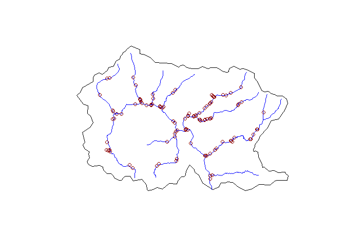
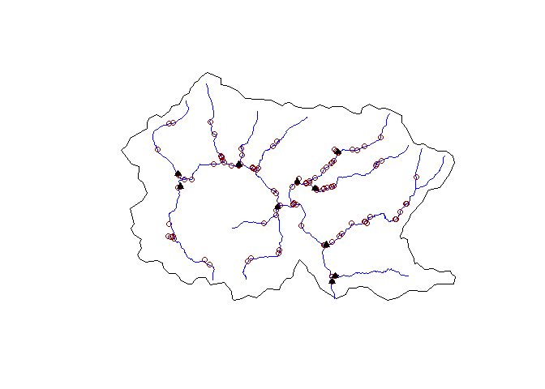

01_data_discovery
================
JTK
2024-12-20

### HOUSEKEEPING

## METADATA ANALYSIS

####### Find all gages upstream of the gage we select. Here, that is the Esopus Creek at Coldbrook Gage. This is the downstream-most gage in the Upper Esopus Creek watershed, right before it empties into the Ashokan Reservoir. We are going to find all the gages & flowlines upstream of this point. Data from these sites are ultimately what we’ll use to train our prediction model.

``` r
#### Esopus Creek at Coldbrook, NY is the gage at the outlet of the 
#### Upper Esopus Creek watershed, which drains to the Ashokan Reservoir
#### We know this gage id (USGS-01362500). 
#### Let's get all the other gages in the watershed upstream of Coldbrook site 

downstream_site_id <- "USGS-01362500"

#### Now create a list that stores both the site id and the type of feature
#### it is. Basically, this tells various functions that this is a
#### USGS NWIS site

downstream_site <- tibble(featureSource = "nwissite",
               featureID = downstream_site_id)


#### Now retrieve the spatial data for our downstream site
#### (Here, Coldbrook, but in general, whichever site is of interest)
downstream_site_feature <- get_nldi_feature(downstream_site)


###############################################################################
#### Download the watershed that drains to our gage
watershed <- get_nldi_basin(downstream_site)

#### Get the flowlines in that watershed
watershed_flowlines <- get_nhdplus(AOI = watershed, realization = "flowline")
```

#### Plot download watershed and flowlines

``` r
#### Plot them
plot.new()

plot(sf::st_geometry(watershed))

plot(sf::st_geometry(watershed_flowlines), col = "blue", add = TRUE)
```

<!-- -->

#### Get just the gages in watershed of interest

``` r
#### Get the gages in our watershed
#### Note that this uses the watershed as a bounding box so the 
#### search area is technically wider than the actual watershed itself
#### (bc it draws a rectangle around the watershed)
gages <- get_geoconnex_reference(watershed, type = "gages",
                                         buffer = 0.0)

#### So we need to trim down to gages actually in the basin
#### Cut out only the gages in the watershed
#### And then, because the ultimate goal is to forecast with
#### the national water model
#### Which provides forecasts at NHD Medium Range reaches
#### Cut out the ones that don't have an associated COMID
#### (meaning they are off NHD MR flowlines)
#### Additionally, if they share a comid, get only the most downstream gage
gages_trim <- sf::st_intersection(gages, watershed) %>%
  drop_na(nhdpv2_comid)


#### And check if they are indeed trimmed by plotting
plot.new()

plot(sf::st_geometry(watershed))

plot(sf::st_geometry(watershed_flowlines), col = "blue", add = TRUE)

plot(gages_trim, col= "darkred", add = TRUE)
```

<!-- -->

#### Now, trim gages to only those with turbidity AND flow data

``` r
################################################################################

#### Now, we only want the stations that have flow and turbidity data
#### So first check to see what data is at each "gage" site in the watershed
#### Here, we only want sites that have instanteous turb and flow data
#### The parameter code for flow data is "00060"
#### The parameter code for trubidity data is "63680"
#### And the service we want is "uv"
#### If the user is interested in other parameter combos at different resolution
#### They will have to
#### change the parameter codes and service type
parameter_codes <- c("00060", "63680")


gages_data <- whatNWISdata(siteNumber = gages_trim$provider_id,
                                  parameterCd = parameter_codes,
                                  service = "uv",
                             siteType = "ST")

#### Then trim by gages that have both flow AND high-res turbidity data
#### And have flow data that goes back at least to 2016 
gages_flow_and_turb <- gages_data %>%
  dplyr::group_by(site_no) %>%
  filter(all(parameter_codes %in% parm_cd)) %>%
  filter(any(parm_cd == "00060" & year(begin_date) <= 2017)) 

#### Now, let's get some meta data for the sites so that
#### we can see each individual drainage area
#### We want to elimate gages that share COMIDs and only get the downstream most station
#### So join in the spatial data to the metadata and slice by drainage area

##### Get the metadata
gages_meta <-  readNWISsite(unique(gages_flow_and_turb$site_no)) %>%
  dplyr::select(site_no, drain_area_va)

##### Join to information about measurements and slice by drainage area
selected_gages <- gages_flow_and_turb %>%
  inner_join(., gages_meta,
             by = "site_no") %>%
  inner_join(., gages_trim %>%
               as_tibble() %>%
               dplyr::select(provider_id, nhdpv2_comid),
             join_by(site_no == provider_id)) %>%
  dplyr::group_by(nhdpv2_comid) %>%
  arrange(desc(drain_area_va), .by_group = TRUE) %>%
  dplyr::slice(1) %>%
  dplyr::ungroup()


#### And finally save just the NWIS gage ids that have both flow and turb data
selected_gages_nwis_ids <- tibble(nwis_id = unique(selected_gages$site_no))

#### And now plot to see which of the gages we selected for use 
gages_trim_trim <- gages_trim %>%
  filter(provider_id %in% selected_gages_nwis_ids$nwis_id)

plot.new()

plot(sf::st_geometry(watershed))

plot(sf::st_geometry(watershed_flowlines), col = "blue", add = TRUE)

plot(gages_trim, col= "darkred", add = TRUE)

plot(gages_trim_trim, pch = 17, color = "black", add = TRUE)
```

<!-- -->
